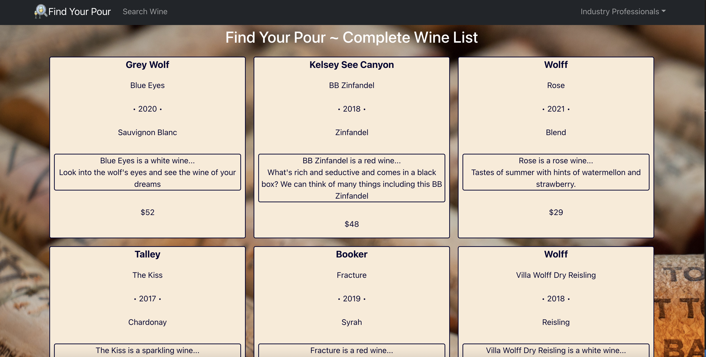

# Find-Your-Pour

# Description

Find Your Pour is a website for wine professionals. It will enable pros to learn about wines from other wineries as well as add their own products to share. It will also provide a forum for wine enthusiasts to rate wines and make comments on any wine they are interested in or on their own products.

# User Story

 As a Winery, I want to post wines + associated info to entice customers.

As a Wine Enthusiast, I want to review and find new amazing wine.

# Usage

New users would first sign up with a user id and password. Once they've done so, they have access to view the wines that are available on the site. If they signed up as a wine professional, they have the ability to comment on the wines they know. Future development will include verification of credentials for wine professionals who wish to sign up as such.

# Technologies Used

Bcrypt, Express.js, GraphQL, Mongoose, React-Bootstrap, React-Dom, HTML, CSS, Javascript

# Screenshots 

# Links
https://fierce-wildwood-04718.herokuapp.com/ 
https://github.com/mayalorimer/Find-Your-Pour

